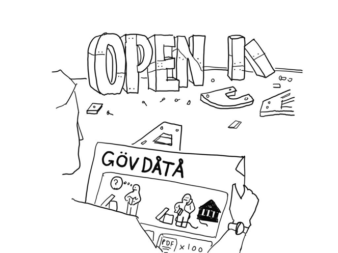

layout: true

`r paste0("
", params$event, " 

")` 

---

class: center, middle

Ces slides en ligne : `r paste0("http://datactivist.coop/", params$slug)`

Sources : `r paste0("https://github.com/datactivist/", params$slug)`

Les productions de Datactivist sont librement réutilisables selon les termes de la licence [Creative Commons 4.0 BY-SA](https://creativecommons.org/licenses/by-sa/4.0/legalcode.fr).

 
 

---

### Au programme de l'après midi

* Présentation de la méthodologie

* Découverte des projets répartis en 3 thématiques : économie verte, économie bleue et industrie créative

* Data wishlist : la liste des données idéales

* … éventuellement démarrer la collecte et l'évaluation des données (selon le niveau d'avancement des groupes)

---
class:inverse, middle, center

## La méthodologie des ateliers

---
### La réutilisation des données : un .red[parcours du combattant] pour les primo-arrivants

.pull-left[
Notre expérience, à travers notamment l’organisation de la [Data Literacy Conference](http://dataliteracyconference.net/2018/), nous a montré que la compréhension des données reste une compétence encore mal répandue dans les organisations. 

Souvent, nous entendons que les données sont arides, froides ou ennuyeuses, que “ce n’est pas pour moi” ou que c’est “trop technique”.]
.pull-right[

]
---

### Obstacle 1 : la .red[découvrabilité]

.pull-left[
A l’heure actuelle, les données sont très difficiles car généralement :
* les moteurs de recherche des portails fonctionnent mal

* les métadonnées sont souvent incomplètes

* les jeux de données sont éparpillés entre plusieurs fichiers, sur différents portails

* les jeux de données ne sont pas harmonisés entre les différents acteurs publics.]
.pull-right[

>“la découvrabilité des données est un pré-requis pour que l’open data réalise son potentiel et, à l’heure actuelle, la plupart des données sont très dures à trouver.” 

[Open Data Index](https://index.okfn.org/insights/)
]
---
### Un exemple de problème de .red[découvrabilité]

---
### Obstacle 2 : la .red[documentation]

Beaucoup de données sont accompagnées d’une description très réduite. 

Sur 12 villes en France, une [étude de Datactivist](https://medium.com/datactivist/qui-a-ouvert-quoi-le-recensement-des-données-des-villes-est-maintenant-ouvert-b7f697135c1f) a montré que : 
* la moitié des descriptions des jeux de données faisait moins de 180 caractères (soit un peu moins de la longueur d’un tweet) 
* 4% des jeux de données ont une description supérieure à 1000 caractères soit moins d’une demi-page. 

Dans ces conditions, il est très difficile pour un usager de comprendre ce que contient le jeu de données, ses conditions de production des données et ses limites. 

---
### Un exemple de données .red[introuvables]
Ce jeu de données contient plus de 6000 marchés publics attribués par l'Etat. Mais, malgré mon [signalement](https://www.data.gouv.fr/fr/datasets/aife-de-44785462100045/#discussion-5c5d2857634f41019657c80d-0), tout est fait pour le rendre introuvable !

[.reduite[]](https://www.data.gouv.fr/fr/datasets/aife-de-44785462100045/)

---
### Obstacle 3 : la .red[qualité] des données

Enfin, le troisième obstacle porte sur la **qualité** des données. 

Le rapport de [l’Open Data Barometer](https://opendatabarometer.org/4thedition/report/) signale  que :
> “les données des gouvernements sont souvent incomplètes, pas actualisées, de mauvaise qualité et fragmentaires”
et 

> “de manière générale, la gestion et la publication des données ouvertes sont fragiles et sujettes à des erreurs multiples.” 

⚠ la qualité des données ne dépend que de l’usage qui en est fait. 

La documentation est indispensable pour que le public parvienne à saisir les usages précédents des données et les adapte à de nouveaux usages, souvent inconnus de celles et ceux qui les produisent. 

---
### Un exemple de données inutilisables

---
### Un autre exemple de données inutilisables

---
### Des .red[opportunités manquées] pour les porteurs de projets

Nombreux sont les porteurs de projet à passer à côté des données du fait des problèmes évoqués précédemment…

--

Pourtant, les données peuvent potentiellement **décupler l’impact d’un projet** et **disposer d’avantages comparatifs décisifs** en : 
* offrant de nouvelles opportunités de création de services
* proposant de nouveaux éclairages sur les phénomènes étudiés 
* en accélérant des processus métier peu optimisés.

--

**Besoin de médiation** pour aider à : 
* trouver les bonnes données
* demander des données manquantes (cf [madada.fr](madada.fr))
* "scrapper" ou extraire par API des données en ligne
* …et parfois acheter des données 

---

### Des .red[échanges trop rares] entre producteurs et réutilisateurs de données

Du côté des acteurs publics, indispensable que les données mises à disposition trouvent un public qui les réutilise pour **valoriser des cas d’usage** qui justifient le travail investi. 

Or, les **espaces d’échange** et de dialogue entre producteurs et réutilisateurs de données sont encore rares mais essentiels pour fluidifier les frictions de la réutilisation. 

--

Les ateliers devront ainsi permettre de **favoriser la rencontre entre porteurs de projet et réutilisateurs** afin d’aider à la découverte de données pertinentes, de prendre en compte les besoins exprimés et d’encourager à l’ouverture des données dont les usagers ont besoin. 

---
### .red[Objectifs] des ateliers

*   Aider les porteurs de projet dans les trois domaines du programme (économies verte et bleue, industrie créative) à **cerner le potentiel data** de leur projet

*   **Démultiplier l’impact de projets** en mobilisant les données ouvertes et en développant de nouvelles formes d’usage

*   **Favoriser la rencontre entre porteurs de projets et producteurs de données ouvertes** pour améliorer la qualité des données

*   **Faire émerger 3 projets emblématiques** qui seront accompagnés en détail dans la mise en œuvre du plan de route data élaboré à l’issue des ateliers.  

---
### .red[Rappel :] dates des ateliers

#### le 5 novembre, 13h30-17h30, à l’EJCAM
21 Rue Virgile Marron, 13005 Marseille

#### le 29 novembre, 13h30-17h30, à l’AMSE
5-9 Boulevard Maurice Bourdet, 13001 Marseille

####le 17 décembre, 13h30-17h30, à la CISAM (sous réserves)
61 Boulevard des Dames, 13002 Marseille

---
### Notre méthodologie : le [parcours d’évaluation du potentiel data](https://infolabs.io/pes)

* Conçu par la FING dans le cadre de la campagne Infolab et enrichi par Simon Chignard. 

* Une méthodologie française documentée, “open source” qui est déjà utilisée en entreprise auprès du groupe UP. 

* Evaluer le potentiel des données (notamment ouvertes) pour un projet en minimum une journée et peut être décomposé en deux ou trois sessions. 

* Ne requiert aucune connaissance technique et s’adapte à tout type de projet

* Débouche sur un **“plan de route données”**, un plan d’action permettant d’intégrer au projet les données utiles selon deux critères : le fort impact sur le projet et l’accessibilité des données.  

---
### Phase 1 : .red[“Wanted Data List”], comprendre les besoins data du projet

--> la liste idéale des données à mobiliser pour le projet. C’est une manière de prendre pied avec le sujet. 

**Décrire les jeux de données de la manière la plus simple**, sans a priori ni référence à un jeu ou un fournisseur de données particulier : c’est la nature des données qui nous intéresse. Par exemple :

*   OK : sens de circulation des rues de Marseille.
*   KO : SIG de la ville de Marseille (ça ne nous dit pas quelle donnée vous intéresse et ne permet donc pas de savoir si elle n’est pas plus accessible ailleurs).

---
### Un exemple de "Wanted Data List"

---

### Phase 2 : la collecte et .red[l’évaluation des données]

Il nous fait maintenant trouver de vrais jeux de données correspondants à travers une phase de **collecte des données**. 

---
### [Conseil] Utiliser les .red[opérateurs spéciaux]

Exemple avec la requête "site:education.gouv.fr filetype:xlsx" :

---
### [Conseil] Utiliser les .red[facettes] pour trouver les bonnes données

.pull-left[

]

.pull-right[
Les facettes sont des filtres dans les métadonnées. 

Elles permettent de sélectionner par exemple uniquement un certain producteur. 

Cela peut faire gagner beaucoup de temps dans une recherche de données.
]
---
### [Conseil] Utiliser les .red[facettes] pour trouver les bonnes données

.pull-left[
Sans filtre par facette, à la requête écoles, on a des résultats étonnants en première page comme ces données de la FEMIS.  
]

.pull-right[
En gardant uniquement "Education Nationale"" dans la facette organisation, on s'assure de trouver des données nationales. 
]
---
### [Conseil] Utiliser .red[Google Dataset Search]

Google propose depuis quelques temps ce [moteur de recherche](https://toolbox.google.com/datasetsearch) aggrégant de très nombreux portails open data. Les résultats sont inégaux mais le moteur est encore nouveau…

---
### [Conseil] Chercher dans le [réseau de données OpenDataSoft](data.opendatasoft.com)
OpenDataSoft référence tous les jeux de données publiés sur l'ensemble de ses portails. Parmi eux, le portail Public référence des jeux de données introuvables ailleurs comme la [localisation des radars](https://data.opendatasoft.com/explore/dataset/radars%40public/table/). 

---
### [Conseil] Trouver le bon .red[tag] sur OSM
La page "[Elements Cartographiques](https://wiki.openstreetmap.org/wiki/FR:%C3%89l%C3%A9ments_cartographiques)" sur le wiki d'OSM recense tous les tags utilisés dans la base de données. 

.footnote[Plus d'infos : https://datactivist.coop/atelier-osm/]

---
### [Conseil] Utiliser des [ressources de curation de données](https://teamopendata.org/t/curation-de-donnees-data-is-plural/734)

Je recense sur [TeamOpenData](https://teamopendata.org/t/curation-de-donnees-data-is-plural/734) les meilleures ressources de curation de données. Une recherche vous aidera à trouver des données internationales que vous ne trouverez généralement pas autrement. 

Par exemple, l'excellente [newsletter Data Is Plural](https://tinyletter.com/data-is-plural/) propose chaque semaine une présentation des meilleurs jeux de données qui sont archivés dans une [feuille de calcul](https://docs.google.com/spreadsheets/d/1wZhPLMCHKJvwOkP4juclhjFgqIY8fQFMemwKL2c64vk/edit#gid=0).

---
### Phase 2 : .red[L'évaluation] des données

.pull-left[
Chaque jeu de données listé dans le catalogue fait l’objet d’une évaluation à travers la “Dataset check list”. 

Cette évaluation produit deux notes sur une échelle de 0 à 4, permettant de positionner chaque jeu de données sur la cartographie des données. 

Au terme de cette évaluation, une cartographie des données permet de visualiser les données à mobiliser en priorité.]
.pull-right[

]

---
### Phase 3 : le .red[plan de route] data

La cartographie des données réalisée à l’étape précédente est un outil pour préparer le plan de route données du projet.5 options en matière de **sourcing des données**: 

1. **Sécuriser** : s’assurer qu’une donnée critique pour le projet ne sera pas dégradée ou que sa fourniture ne sera pas interrompue,
2. **Augmenter** : investir dans l’amélioration d’une donnée, sa qualité ou son niveau de détails,
3. **Collecter** : mettre un place de collecte pour récupérer des données utiles pour le projet mais pas ou peu disponibles - on peut étudier l’intérêt du crowdsourcing,
4. **Nouer des partenariats** : établir des accords avec des tiers pour accéder à leurs données, ou faire de l’échange de donnée entre partenaires,
5. **Acheter** : identifier des sociétés (courtiers en données) qui pourraient vendre les données qui nous manquent.

Ensuite, les porteurs de projet sont invités à **identifier 10 actions à réaliser maintenant / dans les 3 prochains mois / au cours de la prochaine année.**

---
### Pensez à .red[documenter] vos projets 

Les étudiant·e·s du master Data, Information et Communication Digitale (DICOD), option Dispositifs numériques d'information et de communication de l'EJCAM sont là pour vous aider à documenter vos projets et à trouver les données. 

.pull-left[
Remplissez la fiche sur papier ensemble : 

]

.pull-right[
Documentez en ligne ensuite :

]
---
class: inverse, center, middle

# Merci !

Contact : [joel@datactivist.coop](mailto:joel@datactivist.coop)

